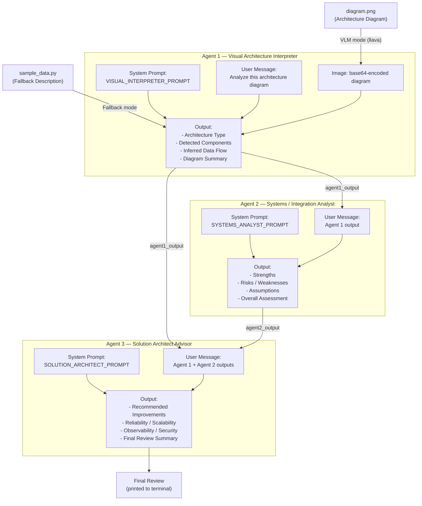

# ArchInsight

**VLM-Powered Multi-Agent Architecture Review System**

ArchInsight is a 3-agent pipeline that analyzes software and integration architecture diagrams and produces a structured architecture review. It uses a vision-language model to interpret diagram images and two text-based LLM agents to assess strengths, risks, and recommend improvements.

---

## Architecture



---

## Agents

| Agent | Role | Model | Input | Output |
|-------|------|-------|-------|--------|
| **Agent 1** — Visual Architecture Interpreter | Interprets an architecture diagram image | VLM (`llava`) | Architecture diagram image | Architecture type, detected components, inferred data flow, summary |
| **Agent 2** — Systems / Integration Analyst | Analyzes the architecture critically | Text LLM (`smollm2:1.7b`) | Agent 1 output | Strengths, risks/weaknesses, assumptions, overall assessment |
| **Agent 3** — Solution Architect Advisor | Recommends improvements | Text LLM (`smollm2:1.7b`) | Agent 1 + Agent 2 outputs | Improvements, reliability/scalability, observability/security, final review |

---

## Project Structure

```
ArchInsight/
├── main.py          # Orchestrator — runs the 3-agent pipeline
├── prompts.py       # System prompts for all 3 agents
├── agents.py        # Agent functions with VLM support (extends course functions.py)
├── sample_data.py   # Fallback sample data when no VLM is available
└── README.md        # This file
```

---

## Setup

### 1. Prerequisites

- Python 3.8+
- [Ollama](https://ollama.com/) installed and running
- `requests` package (`pip install requests`)

### 2. Environment Variables

Create a local `.env` file from the template:

```bash
cp .env.example .env
```

Default values in this project:

- `OLLAMA_HOST=http://localhost:11434`
- `VLM_MODEL=llava`
- `TEXT_MODEL=smollm2:1.7b`

### 3. Pull Models

```bash
# Vision-language model for Agent 1
ollama pull llava

# Text model for Agents 2 and 3
ollama pull smollm2:1.7b
```

### 4. Start Ollama

```bash
ollama serve
```

---

## Usage

### With a real architecture diagram

```bash
cd 06_agents/ArchInsight
python main.py path/to/your/diagram.png
```

Agent 1 will send the image to the `llava` VLM for interpretation.

### Without a diagram (fallback mode)

```bash
cd 06_agents/ArchInsight
python main.py
```

The pipeline uses a pre-written sample architecture description (a microservices e-commerce system) so you can test the full workflow without a VLM model.

---

## Prompt Iteration

The system prompts in `prompts.py` are designed as strong first drafts. Look for `# ITERATE:` comments throughout the file — these mark specific areas where you can refine the prompts based on actual model outputs:

- Adjust verbosity constraints if outputs are too long or too short
- Add domain-specific probes if analysis is too generic
- Tighten output format requirements if markdown structure drifts

---


